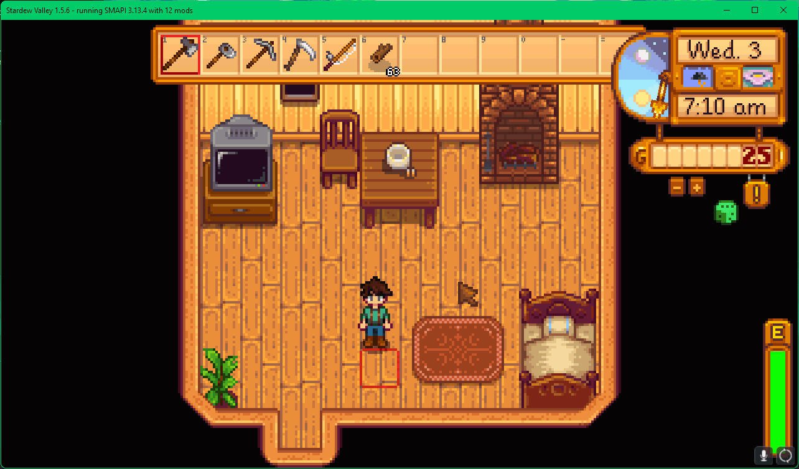

# StardewFishAlmanac
A modification that helps players identify which fish are catchable on the current day.

TODO:

* Readable location names
* Make an action tile somewhere (docks?)
* Find/Create art for the action tile
* Find a way to avoid spoiling locations
* Make a prettier ui (???)
* Gamepad support

